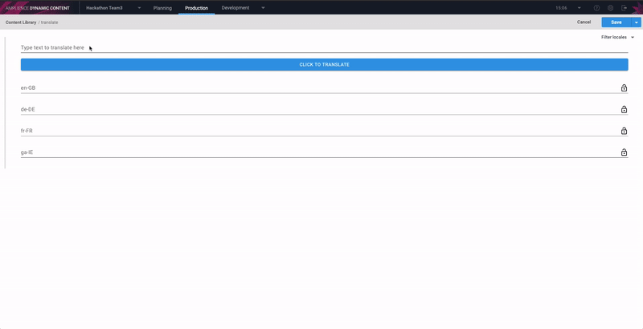
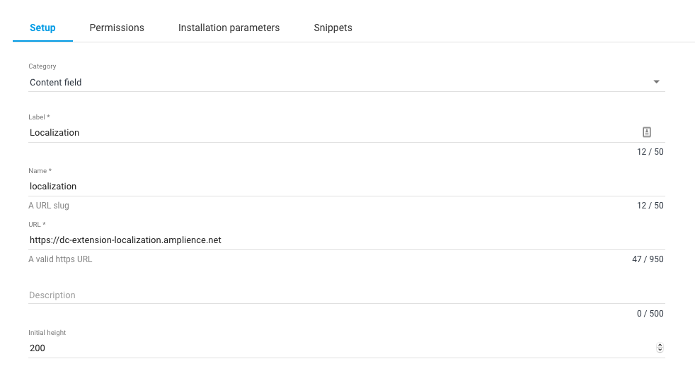
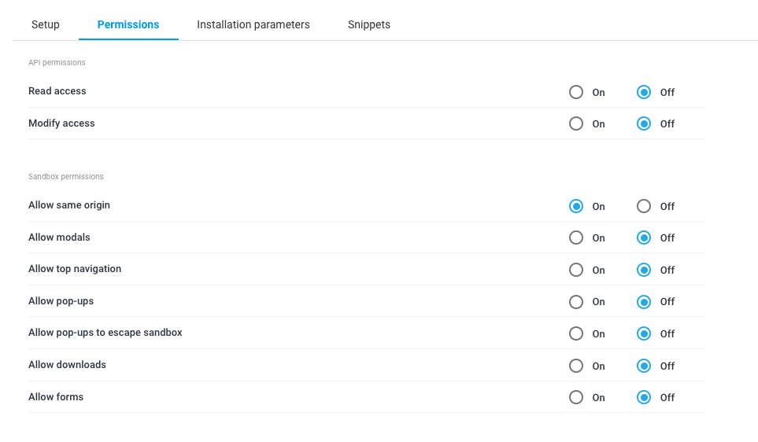

# dc-extension-localization



> Automatic translation based on localized fields.

## How to install

### Register Extension

This extension needs to be [registered](https://amplience.com/docs/development/registeringextensions.html) against a Hub with in the Dynamic Content application (Developer -> Extensions), for it to load within that Hub.

#### Setup



- Category: Content Field
- Label: Localization _(this will appear as the tab title in the Dashboard)_
- Name: localization _(needs to be unique with the Hub)_
- URL: [https://localization.extensions.content.amplience.net](https://localization.extensions.content.amplience.net)

To use the application the following permissions must be enabled:

Note:
You can use our deployed version of this extension (builds from the "production" branch) -

[https://localization.extensions.content.amplience.net](https://localization.extensions.content.amplience.net)

_As this is an open source project you're welcome to host your own "fork" of this project. You can use any standard static hosting service (Netlify, Amplify, Vercel, etc.) if you wish._

##### Permissions



Sandbox permissions:

- Allow same origin

#### Mandatory install parameters

Generate an [OpenAI API Key](https://openai.com/api/) and pass it to the extension.

```json
{
  "TRANSLATION_API_KEY": "<YOUR KEY>"
}
```

#### Optional install params

You can also optionally override the default OpenAI "MODEL" (gpt-5.2) and the "PROMPT" used by adding those params as in the example below.

**\*Note: the text `${locale}` in the prompt must remain.**

```json
{
  "MODEL": "gpt-4o",
  "PROMPT": "You are a professional translator. Detect the input locale from the given content text and use this as the default locale. Translate the content text from the default locale to ${locale}. Return ONLY the translated text with no explanations or additional content. If the detected locale is the same as the required translation locale, use the content text as it was received."
}
```

## Example schema snippets

### Here is a snippet so you can add your extension easily

```json
{
  "title": "title",
  "description": "description",
  "allOf": [
    {
      "$ref": "http://bigcontent.io/cms/schema/v1/localization#/definitions/localized-string"
    }
  ],
  "ui:extension": {
    "name": "<your name of extension here>"
  }
}
```

## Content Type Schema

Here is a basic schema just including the translate custom extension.

```json
{
  "$schema": "http://json-schema.org/draft-07/schema#",
  "$id": "http://localise.com",

  "title": "Title",
  "description": "Description",

  "allOf": [
    {
      "$ref": "http://bigcontent.io/cms/schema/v1/core#/definitions/content"
    }
  ],

  "type": "object",
  "properties": {
    "localise": {
      "title": "title",
      "description": "description",
      "allOf": [
        {
          "$ref": "http://bigcontent.io/cms/schema/v1/localization#/definitions/localized-string"
        }
      ],
      "ui:extension": {
        "name": "<your name of extension here>"
      }
    }
  },
  "propertyOrder": []
}
```

## Development

This project requires Node 16.x to build. Tested with Node 16.16.0, NPM 8.11.0.

### Running locally

```bash
$ npm run start
```

### How to build

```bash
$ npm run build
```
