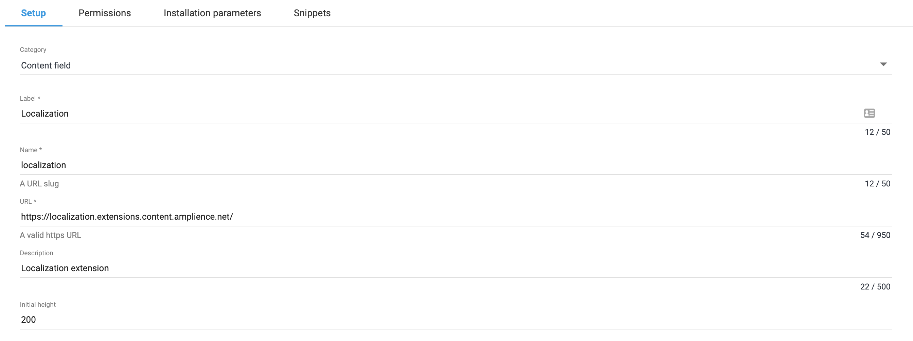

[](https://amplience.com/dynamic-content)

# dc-extension-localization


> Automatic translation based on localized fields.


## How to install

### Register Extension

This extension needs to be [registered](https://amplience.com/docs/development/registeringextensions.html) against a Hub with in the Dynamic Content application (Developer -> Extensions), for it to load within that Hub.

#### Setup



* Category: Content Field
* Label: Localization _(this will appear as the tab title in the Dashboard)_
* Name: localization _(needs to be unique with the Hub)_
* URL: [https://localization.extensions.content.amplience.net](https://localization.extensions.content.amplience.net)

To use the application the following permissions must be enabled:

Note:
You can use our deployed version of this extension (builds from the "production" branch) -

[https://localization.extensions.content.amplience.net](https://localization.extensions.content.amplience.net)

_As this is an open source project you're welcome to host your own "fork" of this project. You can use any standard static hosting service (Netlify, Amplify, Vercel, etc.) if you wish._

##### Permissions


Sandbox permissions:
- Allow same origin

#### Install parameters

Generate a [Yandex API Key](https://translate.yandex.com/developers/keys) and pass it to the extension:


```json
{
    "TRANSLATION_API_KEY": "<YOUR KEY>"
}
```

## Example schema snippets

### Here is a snippet so you can add your extension easily

```json
{
    "title": "title",
    "description": "description",
    "allOf": [
        {
            "$ref": "http://bigcontent.io/cms/schema/v1/localization#/definitions/localized-string"
        }
    ],
    "ui:extension": {
        "name": "<your name of extension here>"
    }
}
```

## Content Type Schema

Here is a basic schema just including the translate custom extension.

```json
{
    "$schema": "http://json-schema.org/draft-07/schema#",
    "$id": "http://localise.com",

    "title": "Title",
    "description": "Description",

    "allOf": [
        {
            "$ref": "http://bigcontent.io/cms/schema/v1/core#/definitions/content"
        }
    ],

    "type": "object",
    "properties": {
        "localise": {
            "title": "title",
            "description": "description",
            "allOf": [
                {
                    "$ref": "http://bigcontent.io/cms/schema/v1/localization#/definitions/localized-string"
                }
            ],
            "ui:extension": {
                "name": "<your name of extension here>"
            }
        }
    },
    "propertyOrder": []
}
```
## Running locally

```bash
$ npm run start
```

## How to build

```bash
$ npm run build
```